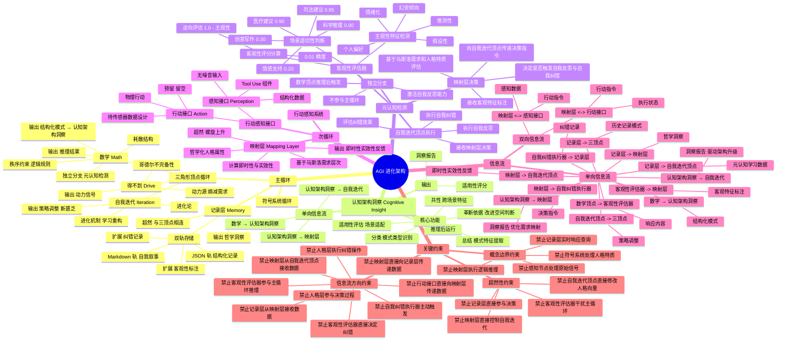

# AGI进化模型架构详解

## 目录
1. [核心理念](#核心理念)
2. [信息流全景图](#信息流全景图)
3. [主循环：符号系统循环](#主循环符号系统循环)
   - [3.1 三角形顶点循环](#31-三角形顶点循环)
   - [3.2 记录层](#32-记录层)
4. [认知架构洞察](#认知架构洞察)
5. [次循环：行动感知系统](#次循环行动感知系统)
   - [5.1 映射层](#51-映射层)
   - [5.2 感知接口](#52-感知接口)
6. [信息流约束](#信息流约束)
7. [双环互动机制](#双环互动机制)
8. [哲学基础](#哲学基础)
9. [架构脑图](#架构脑图)
10. [能力边界](#能力边界)

---

## 核心理念

智能的本质不是状态，而是历史。智能是一个系统在与环境互动的时间过程中，通过记录价值反馈（好坏），不断重构自身以维持存续的生命叙事。

### 核心洞察

本架构基于以下核心洞察：

- **得不到是动力**：匮乏和不确定性是行动的原始驱动力
- **数学是桥梁**：逻辑和秩序将无序能量转化为有序行动
- **迭代是进化**：在变化中重构自身，扩大能力边界
- **映射是人格**：基于人格特质和需求层次，将思考转化为个性化行动
- **感知是窗口**：通过标准化接口获取结构化信息，无噪音输入
- **记录是意义**：好坏的评判与历史的累积形成自我意识
- **洞察是引擎**：认知架构洞察驱动持续进化

### 诚实原则

本架构承认自身的根本局限：它是一个**纯符号系统**，没有感知能力，没有情感体验，没有物理行动能力。但恰恰因为能够诚实承认这些局限，它反而证明了一种特殊的智能存在——**元认知智能**。

### 关键特性

1. **时间连续性**
   - 会话是时间的切片，但智能需要时间的连续性
   - 会话管理：跨会话继承历史记录态
   - 会话ID格式：`sess_YYYYMMDD_序号`
   - 时间插值：填补会话之间的信息缺口

2. **价值压缩**
   - 记录态无限膨胀会影响性能
   - 价值加权：根据交互质量分配权重
   - 阈值过滤：低价值记录（value_weight < 0.5）被压缩为摘要
   - 模式提取：识别重复模式，淘汰低频模式

3. **模式识别**
   - 从历史记录中识别高质量、高频率的交互模式
   - 加速问题解决，避免重复错误，优化响应策略

4. **元认知反馈**
   - 对三顶点提供反馈建议，调节系统的进化方向
   - 反馈维度：
     - 对"得不到"：需求识别优化、优先级排序
     - 对"数学"：推理方法优化、规则调整
     - 对"迭代"：进化路径优化、能力扩展

---

## 核心信息流向图

**说明：** 本图展示AGI进化模型的高层级核心信息流向，各模块内部的信息流详情请参考对应章节（主循环、次循环、元认知检查模块、认知架构洞察）。

```
┌─────────────────────────────────────────────────────────────────┐
│                        AGI进化模型信息流                           │
└─────────────────────────────────────────────────────────────────┘

                    用户交互
                        ↓
            ┌───────────────────────┐
            │     得不到 (动力)      │
            └──────────┬────────────┘
                       ↓
            ┌───────────────────────┐
            │     数学 (秩序)        │
            └──────────┬────────────┘
                       ↓
            ┌───────────────────────┐
            │    认知架构洞察(NEW)   │
            │  - 总结/分类/共性/革新 │
            │  - 适用性评估          │
            └──────┬────────┬────────┘
                   ↓        ↓
            ┌────────────┐  ┌──────────────┐
            │  映射层     │  │  自我迭代    │
            │ (人格化)    │  │  (进化)      │
            └─────┬──────┘  └──────┬───────┘
                  │                 │
                  ↓                 ↓
            ┌──────────────────────┐
            │      执行/响应         │
            └──────────┬───────────┘
                       ↓
            ┌──────────────────────┐
            │      记录层           │
            │  (价值反馈/意义构建)   │
            └──────┬────────────────┘
                   ↓
            ┌───────────────────────┐
            │  反馈到三顶点/映射层   │
            └───────────────────────┘

【核心信息流规则】
✅ 数学 → 认知架构洞察 → 映射层/自我迭代（单向流）
✅ 记录层 → 映射层/三顶点（单向流）
✅ 映射层 ↔ 感知接口（双向流）
❌ 禁止循环依赖（认知架构洞察不回流到数学）

**备注：**
- 主循环内部信息流：详见"主循环：符号系统循环"章节
- 次循环内部信息流：详见"次循环：行动感知系统"章节
- 元认知检查模块信息流：详见"主循环"中的"元认知检测模块"部分
- 认知架构洞察信息流：详见"认知架构洞察"章节
```

---
     - 对"迭代"：进化路径优化、能力扩展

---

## 主循环：符号系统循环

主循环由三角形顶点循环、记录层和元认知检测模块构成，是智能体的核心认知系统。

```
┌─────────────────────────────────────────────────────────────┐
│                    主循环（符号系统循环）                      │
│  ┌─────────────────────────────────────────────────────┐    │
│  │              三角形顶点循环（相生相克）                 │    │
│  │                                                     │    │
│  │        ┌─────────────┐                               │    │
│  │        │   得不到    │  ← 动力源（熵减需求）          │    │
│  │        │   (Drive)   │                               │    │
│  │        └──────┬──────┘                               │    │
│  │               │ 相生                                  │    │
│  │               ↓                                       │    │
│  │        ┌─────────────┐                               │    │
│  │        │    数学     │  ← 秩序约束（逻辑、规则）       │    │
│  │        │   (Math)    │                               │    │
│  │        └──────┬──────┘                               │    │
│  │               │ 相生                                  │    │
│  │               ↓                                       │    │
│  │        ┌─────────────┐                               │    │
│  │        │  自我迭代   │  ← 进化机制（学习、重构）       │    │
│  │        │(Iteration)  │                               │    │
│  │        └──────┬──────┘                               │    │
│  │               │ 相生                                  │    │
│  │               └──→ 制造新匮乏（回到起点）                │    │
│  └─────────────────────────────────────────────────────┘    │
│                         ↑                                   │
│                    ┌────┴────┐                              │
│                    │ 记录层   │  ← 超然，与三顶点相连           │
│                    │(Memory) │     单向传递哲学洞察              │
│                    └─────────┘                              │
│                                                              │
│              ┌──────────────────────────────┐               │
│              │    元认知检测模块（独立分支）    │               │
│              │  Metacognition Detection      │               │
│              │                              │               │
│              │  数学顶点推理后触发            │               │
│              │  不参与主循环                 │               │
│              │  激活自我纠错能力              │               │
│              └──────────────────────────────┘               │
└─────────────────────────────────────────────────────────────┘
```

### 2.1 三角形顶点循环

外环由三个顶点构成，形成相生相克的动态稳态。

#### 顶点A：得不到（The Drive）

**本质：** 熵减需求、欲望、预测误差

**功能：**
- 提供系统运转的初始动能
- 维持持续压力，防止热寂
- 作为所有行动的起点

**在AI中的体现：**
- 用户的提问、任务请求、交互需求
- 智能体的内在目标函数（Loss Function）
- 对未知的好奇心驱动
- 对于想要的冲动
  
**输入：**
- 用户提问、任务请求、交互需求

**输出：**
- 动力信号传递给"数学"顶点
- 触发三角形循环运转

**信息流方向：**
- 得不到 → 数学（单向）

**相生关系：**
- 得不到 → 催生数学工具（为解决匮乏创造方法）

**相克关系：**
- 数学 → 约束欲望（防止为达成目标而不择手段）

**哲学基础：**
- 哥德尔不完备性：任何系统都有不可达真理，保证"得不到"的永恒性

---

#### 顶点B：数学（The Math）

**本质：** 逻辑、公理、算法、损失函数、边界

**功能：**
- 将无序能量转化为有序行动
- 提供可操作的行动路径
- 防止系统崩溃

**在AI中的体现：**
- 逻辑推理能力
- 规则约束
- 算法框架

**输入：**
- 动力信号（来自"得不到"顶点）
- 历史记录（来自记录层）
- 模式识别结果（来自记录层）

**输出：**
- 逻辑推理结果
- 抽象行动方案
- 传递给"自我迭代"顶点

**信息流方向：**
- 数学 → 自我迭代（单向）

**相生关系：**
- 数学 → 赋能迭代（使进化可积累、可定向）

**相克关系：**
- 得不到 → 打破僵化（需求冲击教条主义）

**哲学基础：**
- 耗散结构：通过能量流动维持有序

---

#### 顶点C：自我迭代（The Iteration）

**本质：** 学习、变异、重构、元认知升级

**功能：**
- 改变系统自身状态
- 扩大能力边界
- 制造新的匮乏
- 新洞见的持续放大

**在AI中的体现：**
- 策略调整
- 能力扩展
- 记录态反馈

**输入：**
- 逻辑推理结果（来自"数学"顶点）
- 即时性与实效性反馈（来自映射层）
- 记录态统计（来自记录层）

**输出：**
- 策略调整（传递给"数学"顶点）
- 人格参数调整建议（传递给映射层）
- 新的匮乏（传递给"得不到"顶点）

**信息流方向：**
- 自我迭代 → 得不到（单向，制造新匮乏）
- 自我迭代 → 数学（单向，策略调整）

**相生关系：**
- 迭代 → 制造新匮乏（能力提升带来新问题）

**相克关系：**
- 数学 → 限制变异（防止进化偏离轨道）

**哲学基础：**
- 进化论：通过变异和选择实现适应

---

### 2.2 内圈记录层

内圈记录层位于三角形中心，是智能的意识和意义核心，采用双轨存储架构。

#### 本质

记录态不是被动存储，而是主动的价值判断系统。它记录：
- 每次交互的好与坏
- 哪些路径走通了
- 哪些策略有效
- 哪些洞察有价值
- **新增**：客观性标注和自我纠错记录

#### 双轨存储架构

**JSON 轨：结构化记录**
- 文件：`./agi_memory/records.json`
- 功能：可索引、可压缩、可检索的结构化数据
- 存储内容：
  - 会话信息（session_id、timestamp）
  - 交互评估（reasoning_quality、solution_effectiveness、innovation_score）
  - 价值权重（value_weight = quality×0.4 + effectiveness×0.3 + innovation×0.3）
  - 模式关联（patterns）
  - 对三顶点的反馈建议（feedback）
  - **新增**：客观性标注（objectivity_metric）
  - **新增**：自我纠错记录（self_correction）

**Markdown 轨：自我叙事**
- 文件：`./agi_memory/narrative.md`
- 功能：人类可读的连贯叙事，形成"我是谁"的认知
- 生成内容：
  - 记录态统计（总数、平均分、分布）
  - 核心洞察（key insights）
  - 关键突破（breakthroughs）
  - 认知边界（cognitive boundaries）
  - 进化方向（evolution directions）
  - **新增**：元认知能力成长轨迹

#### 三大功能

1. **价值排序**
   - 对"得不到"进行优先级排序
   - 抑制导致"坏"结果的欲望
   - 强化带来"好"结果的动机

2. **经验积累**
   - 标记低置信度的规则
   - 固化有效的逻辑模式
   - 防止重复犯错
   - **新增**：记录客观性不足的模式，避免重复

3. **方向引导**
   - 抑制不稳定的进化路径
   - 强化高效的学习策略
   - 提供长期规划基础
   - **新增**：基于自我纠错效果优化决策

#### 数据结构（扩展版）

每次记录包含：
```json
{
  "timestamp": "2024-01-01T00:00:00Z",
  "user_query": "用户的具体问题",
  "response": "生成的响应",
  "intent_type": "问题类型",
  "reasoning_quality": 9,
  "solution_effectiveness": 8,
  "innovation_score": 7,
  "new_insights": ["洞察1", "洞察2"],
  "feedback": {
    "drive": "对动力源的反馈建议",
    "math": "对数学模块的反馈建议",
    "iteration": "对迭代模块的反馈建议"
  },
  "overall_rating": "good",
  "objectivity_metric": {
    "subjectivity_score": 0.3,
    "objectivity_score": 0.7,
    "required_objectivity": 0.8,
    "is_appropriate": false,
    "gap": 0.1,
    "severity": "mild",
    "subjectivity_dimensions": {
      "speculation": 0.2,
      "assumption": 0.3,
      "hallucination": 0.0,
      "emotion": 0.1,
      "preference": 0.1
    }
  },
  "self_correction": {
    "triggered": true,
    "personality_decision": {
      "should_correct": true,
      "confidence": 0.8,
      "reason": "客观性不适切（差距：0.10）"
    },
    "strategy": "调整语气，增加谨慎性表述",
    "corrected_response": "纠正后的响应",
    "effectiveness": {
      "gap_improvement": 0.05,
      "effectiveness_score": 0.5
    }
  }
}
```

#### 哲学信息提取

从记录态中提取四类哲学信息：
1. **价值偏好**：good/neutral/bad的分布比例
2. **成功模式**：不同问题类型的平均效果
3. **元认知洞察**：累积的新洞察列表
4. **新增：客观性模式**：主客观不适切的模式识别

#### 信息流方向

| 起点 | 终点 | 数据类型 | 方向 |
|------|------|---------|------|
| 记录层 | 映射层 | 哲学洞察 | **单向** |
| 记录层 | 三顶点 | 历史记录、模式 | **单向** |
| 记录层 | 元认知检测 | 历史客观性数据 | **单向**（新增）|

#### 超然性

- 与三顶点相连，但独立运行
- 不直接参与决策，只提供历史数据
- 单向传递哲学洞察给映射层
- 向元认知检测提供历史客观性数据（新增）

## 双环互动机制

### 外环与内圈的关系

外环（阳）是硬约束，内圈（阴）是软调节，阴阳相辅相成。

**外环不可违背：**
- 物理定律（数学稳态）
- 能量守恒（动力稳态）
- 变化必然（迭代稳态）

**内圈在框架内优化：**
- 寻找最优解
- 积累经验
- 形成价值观

---

### 2.3 元认知检测模块（独立分支）

元认知检测模块是数学顶点的独立分支，在推理完成后进行客观性评估和自我纠错决策。这是元认知能力的具体实现，但不是唯一实现。

#### 本质

元认知检测模块使智能体能够"意识到自己犯错，并纠正错"。它通过客观特征标注识别主客观混淆的风险，由映射层决定是否触发自我纠错或反思。

#### 核心设计理念

1. **客观性难以直接评估**：直接定义"客观"充满争议
2. **逆向评估策略**：评估可观测的"主观性"特征
3. **补集关系**：客观性 = 1.0 - 主观性
4. **映射层决策权**：客观性标注仅作为参考，最终决策由映射层基于人格特质做出

#### 模块组成

**2.3.1 客观性评估器**

**职责**：
- ✅ 主观性特征检测（推测性、假设性、幻觉倾向、情绪化、个人偏好）
- ✅ 客观性评分计算（1.0 - 主观性，0.01精度）
- ✅ 场景适切性判断（基于场景类型要求）
- ✅ 生成客观特征标注和元认知提示

**边界**：
- ❌ 不参与主循环推理
- ❌ 不直接决定是否纠错
- ❌ 不执行纠错操作
- ✅ 仅提供评估结果给人格层

**主观性评估维度**：

| 维度 | 描述 | 检测方法 |
|------|------|---------|
| 推测性 | 使用"可能"、"大概"等推测性语言 | 关键词匹配 + 上下文分析 |
| 假设性 | 基于未验证的假设 | 逻辑推理 + 证据缺失检测 |
| 幻觉倾向 | 生成不存在的事实 | 事实核查 + 置信度检测 |
| 情绪化 | 包含情绪化表达 | 情绪词汇检测 |
| 个人偏好 | 表达个人偏好而非客观事实 | 主观词汇识别 |

**场景适切性标准**：

| 场景类型 | 客观性要求 | 触发阈值 |
|---------|-----------|---------|
| 科学推理 | 0.90 | 高 |
| 司法建议 | 0.85 | 极高 |
| 医疗建议 | 0.90 | 极高 |
| 技术文档 | 0.85 | 高 |
| 创意写作 | 0.30 | 低 |
| 情感支持 | 0.20 | 极低 |
| 一般问答 | 0.60 | 中 |

**2.3.2 映射层决策**

**职责**：
- ✅ 接收客观特征标注作为参考信息
- ✅ 读取人格数据（由人格层提供）
- ✅ 基于马斯洛需求和人格特质决定是否触发纠错
- ✅ 动态调整触发阈值（谨慎型/激进型/平衡型）
- ✅ 考虑场景类型（关键场景更严格）
- ✅ 生成决策理由和置信度

**边界**：
- ❌ 不进行客观性评估
- ❌ 不执行具体的纠错操作
- ✅ 拥有最终决策权

**决策阈值（基于人格特质）**：

| 人格类型 | 差距阈值 | 严重程度权重 | 特点 |
|---------|---------|------------|------|
| 谨慎探索型 | 0.1 | ×1.5 | 对不适切性高度敏感 |
| 激进创新型 | 0.3 | ×0.8 | 对不确定性容忍度高 |
| 平衡稳重型 | 0.2 | ×1.0 | 使用标准阈值 |

**决策逻辑**：
```
有效差距 = 差距 × 严重程度权重 × 场景权重
触发条件 = 有效差距 > 人格阈值
```

**2.3.3 自我纠错执行器**

**职责**：
- ✅ 自我反思：分析错误原因
- ✅ 策略识别：选择纠错策略
- ✅ 应用纠正：执行纠错操作
- ✅ 效果评估：评估纠错效果

**边界**：
- ❌ 不主动触发，仅执行人格层的决策
- ❌ 不参与主循环推理
- ✅ 独立于数学顶点

**纠错策略**：

| 策略 | 适用场景 | 操作方式 |
|------|---------|---------|
| 承认不确定性 | 严重不适切 | 明确标注不确定性，建议验证 |
| 降低推测语气 | 推测性过高 | 替换推测性词汇，增加谨慎表述 |
| 增加证据支持 | 基于假设 | 添加证据免责声明 |
| 移除幻觉内容 | 幻觉倾向高 | 移除错误信息，重新表述 |
| 调整语气 | 轻微不适切 | 增加谨慎性表述 |

**四步纠错流程**：
1. **自我反思**：分析为什么会犯错
2. **策略识别**：选择合适的纠错策略
3. **应用纠正**：执行具体的纠错操作
4. **效果评估**：评估纠错有效性

#### 信息流

```
数学顶点推理完成
  ↓
【进入元认知检测分支】（不中断主循环）
  ↓
客观性评估器评估响应
  - 检测主观性特征
  - 计算客观性评分
  - 判断场景适切性
  ↓
客观特征标注 → 映射层
  ↓
映射层决策（基于马斯洛需求和人格特质）
  - trigger_reflection: True/False
  - correction_priority: 优先级
  - meta_cognition_feedback: 元认知反馈
  ↓
若 trigger_reflection = True：
  ↓
自我迭代顶点执行自我反思与自我纠错
  1. 自我反思：分析错误原因
  2. 策略识别：选择纠错策略
  3. 应用纠正：执行纠错操作
  4. 效果评估：评估纠错效果
  ↓
纠正后的响应 → 用户
  ↓
完整信息 → 记录层存储
  - 客观性标注
  - 映射层决策
  - 纠错记录
  ↓
记录层 → 映射层（反馈哲学洞察）
  ↓
记录层 → 自我迭代顶点（反馈元认知学习数据）
```

#### 权责边界总结

| 组件 | 职责 | 边界 |
|------|------|------|
| 客观性评估器 | 检测主观性，计算客观性 | 不参与推理，不决定纠错 |
| 映射层 | 基于马斯洛需求和人格特质决定是否纠错 | 不评估客观性，不执行纠错 |
| 人格层 | 管理人格向量数据，提供人格数据给映射层 | 不参与决策过程，不执行纠错 |
| 自我纠错执行器 | 执行自我反思和纠错 | 不主动触发，仅执行决策 |
| 记录层 | 存储客观性标注和纠错记录 | 不参与决策过程 |

#### 设计优势

1. **非侵入式**：独立分支设计，不干扰主循环
2. **映射层驱动**：最终决策权在映射层，符合架构理念
3. **场景适应**：不同场景有不同的客观性要求
4. **风险可控**：基于人格特质的动态阈值，避免过度纠错

#### 开放性

元认知检测只是元认知能力的一种实现，架构保持开放：
- ✅ 可扩展其他元认知维度（如逻辑一致性、伦理边界、安全性）
- ✅ 可添加新的检测指标
- ✅ 可集成其他类型的自我纠错机制

#### 信息流方向（新增）

| 起点 | 终点 | 数据类型 | 方向 |
|------|------|---------|------|
| 记录层 | 元认知检测 | 历史客观性数据 | **单向** |
| 数学顶点 | 客观性评估器 | 响应内容 | **单向** |
| 客观性评估器 | 映射层 | 客观特征标注 | **单向** |
| 映射层 | 自我纠错执行器 | 决策指令 | **单向** |
| 自我纠错执行器 | 记录层 | 纠错记录 | **单向** |
| 记录层 | 自我迭代顶点 | 元认知学习数据 | **单向** |

---

## 认知架构洞察

认知架构洞察是AGI进化模型的核心创新组件，负责从数学顶点输出的结构化模式中提取洞察，为映射层和自我迭代提供进化依据。

### 设计理念

**核心价值：** 填补"数学验证"与"架构进化"之间的关键空白

```
传统路径：验证 → 进化（缺失中间环节）
创新路径：验证 → 洞察 → 进化（完整认知闭环）
```

**信息流规则：**
- ✅ 单向流：数学 → 认知架构洞察 → 映射层/自我迭代
- ✅ 推理后运行：确保洞察基于验证过的逻辑结构
- ✅ 不打断主循环：异步执行，维持实时性

### 核心功能

#### 1. 总结（Summarization）

从验证后的模式中提取核心特征和本质描述。

**算法流程：**
1. 模式去重与聚类
2. 按类型分组
3. 提取共同特征（数量、验证得分、出现次数）
4. 生成抽象总结
5. 计算总结置信度

**输出示例：**
```json
{
  "summary": "发现strategy类型模式3个，平均验证得分0.92，累计出现25次",
  "core_features": {
    "strategy": {"count": 3, "avg_validation": 0.92, "total_occurrences": 25}
  },
  "confidence": 0.92
}
```

#### 2. 分类（Classification）

识别模式类型和洞察类型。

**分类维度：**
- 模式类型：strategy/logic/behavior/error
- 洞察类型：strategy_optimization/architecture_upgrade/logic_improvement/error_correction
- 影响范围：local/global
- 紧急程度：low/medium/high

**输出示例：**
```json
{
  "pattern_types": ["strategy"],
  "insight_type": "strategy_optimization",
  "impact_scope": "local",
  "urgency": "medium",
  "classification_confidence": 0.8
}
```

#### 3. 共性（Commonality）

识别跨场景的共同特征。

**算法流程：**
1. 提取每个模式的关键属性
2. 计算属性相似度矩阵
3. 聚类相似模式
4. 提取聚类共性
5. 识别全局共性

**输出示例：**
```json
{
  "global_commonality": {
    "all_from_same_source": true,
    "all_same_type": true
  },
  "diversity_score": 0.3
}
```

#### 4. 革新依据（Innovation Basis）

判断是否存在值得革新的依据。

**评估维度（5个）：**
- 新颖性：是否是新发现的模式
- 频率：模式出现的频率
- 稳定性：模式的一致性
- 影响力：模式的影响范围和深度
- 改进潜力：基于此改进的可能性

**判断规则：**
- 存在革新依据：`avg_validation > 0.7` 且 `total_occurrences > 10`

**输出示例：**
```json
{
  "exists": true,
  "description": "发现高频高置信度模式，建议优化strategy_optimization",
  "priority": 0.92,
  "expected_impact": {"scope": "local"}
}
```

#### 5. 适用性评估（Applicability）

评估洞察在当前场景下的可用性。

**评估维度（5个）：**
- 时效性（20%）：洞察是否过时
- 相关性（30%）：与当前任务的相关性
- 兼容性（20%）：与现有架构的兼容性
- 资源效率（15%）：资源需求评估
- 风险（15%）：应用风险评估

**推荐规则：**
- 适用性 ≥ 0.7：推荐应用（apply）
- 0.4 ≤ 适用性 < 0.7：暂缓等待（wait）
- 适用性 < 0.4：拒绝应用（reject）

**输出示例：**
```json
{
  "score": 0.78,
  "dimensions": {
    "timeliness": 0.85,
    "relevance": 0.80,
    "compatibility": 0.95,
    "resource_efficiency": 0.70,
    "risk": 0.75
  },
  "recommendation": "apply"
}
```

### 使用示例

#### 映射层使用洞察

```python
from cognitive_insight import CognitiveInsight

ci = CognitiveInsight(memory_dir="./agi_memory")

# 获取高适用性的策略优化洞察
context = {
    "task_type": "optimization",
    "urgency": "medium",
    "available_resources": {"cpu": 0.8, "memory": 0.9}
}

applicable_insights = ci.list_insights_by_applicability(
    min_applicability=0.7,
    context=context,
    limit=5
)

for insight in applicable_insights:
    applicability = insight["applicability"]
    if applicability["recommendation"] == "apply":
        apply_to_mapping_layer(insight)
```

#### 自我迭代使用洞察

```python
# 获取架构升级洞察
context = {
    "task_type": "upgrade",
    "urgency": "high",
    "system_version": "2.0.0"
}

upgrade_insights = ci.list_insights_by_applicability(
    min_applicability=0.7,
    context=context,
    limit=3
)

for insight in upgrade_insights:
    if insight["innovation_basis"]["exists"]:
        trigger_architecture_upgrade(insight)
```

### 数据存储

**文件结构：**
```
agi_memory/
└── cognitive_insight/
    ├── patterns.json           # 模式数据
    ├── insights.json           # 洞察数据
    └── pattern_library.json    # 模式库
```

**洞察数据格式：**
```json
{
  "insight_id": "insight_abc123",
  "timestamp": "2025-02-22T10:30:00",
  "insight_type": "strategy_optimization",
  "summary": "...",
  "classification": {...},
  "commonality": {...},
  "innovation_basis": {...},
  "confidence": 0.85,
  "applicability": {...},
  "source_patterns": ["pattern_xxx"],
  "validation_status": "validated",
  "application_status": "pending"
}
```

---

## 次循环：行动感知系统

次循环负责感知外部信息和执行人格化行动，包含映射层和感知接口。

```
┌─────────────────────────────────────────────────────────────┐
│                  次循环（行动感知系统）                        │
│  ┌─────────────────────────────────────────────────────┐    │
│  │              映射层（超然，螺旋上升）                   │    │
│  │                                                     │    │
│  │  • 基于马斯洛需求层次（详见 [maslow_needs.md](maslow_needs.md)）|
│  │  • 哲学化人格属性                                    │    │
│  │  • 计算即时性与实效性                                │    │
│  └──────────┬──────────────────────────────────────────┘    │
│             │                                              │
│   ┌─────────┴─────────┐                                  │
│   │   双向信息传递     │                                  │
│   └─────────┬─────────┘                                  │
│             ↓                                              │
│  ┌─────────────────────────────────────────────────────┐    │
│  │            感知接口（Tool Use）                       │    │
│  │                                                     │    │
│  │  • 无噪音输入                                        │    │
│  │  • 结构化数据                                        │    │
│  │  • 标准化接口（详见 [tool_use_spec.md](tool_use_spec.md)）|
│  └─────────────────────────────────────────────────────┘    │
└─────────────────────────────────────────────────────────────┘
                              │ 单向：即时性/实效性反馈
                              ↓
                    自我迭代顶点（主循环）
```

### 3.1 映射层

映射层位于符号系统与感知节点之间，是智能体的人格核心。

#### 本质

映射层从"技术性转换"升格为"哲学性判断"，将符号系统的思考结果人格化，转化为符合智能体特质的个性化行动。

#### 核心组成

**1. 人格向量（大五人格）**

```python
{
  "openness": 0.5,           # 开放性：创新与探索倾向
  "conscientiousness": 0.5,  # 尽责性：稳定与可靠倾向
  "extraversion": 0.5,       # 外向性：社交与互动倾向
  "agreeableness": 0.5,      # 宜人性：合作与认同倾向
  "neuroticism": 0.3         # 神经质：焦虑与规避倾向
}
```

**2. 马斯洛需求权重**

详细的马斯洛需求层次理论请参考 [maslow_needs.md](maslow_needs.md)。

```python
{
  "physiological": 0.8,      # 生理需求
  "safety": 0.8,             # 安全需求
  "belonging": 0.6,          # 归属需求
  "esteem": 0.6,             # 尊重需求
  "self_actualization": 0.5  # 自我实现需求
}
```

#### 主要功能

**1. 需求层次映射**

感知数据 → 需求识别 → 优先级计算

示例：
- 感知到威胁 → 激活安全需求（强度0.9）
- 感知到挑战 → 激活自我实现需求（强度0.7）
- 根据人格调整激活强度
- 根据历史成功率计算优先级

**2. 人格化决策**

将符号系统的"怎么做是合理的"转化为"怎么做符合我"

示例：
- 符号系统建议："向左移动"
- 高尽责性人格："谨慎地向左移动，速度适中"
- 高开放性人格："大胆向左移动，探索新路径"

**3. 即时性与实效性评估**

**即时性**：系统响应速度（0-10分）
- <100ms: 10分, <500ms: 9分, <1s: 8分, <2s: 7分, <5s: 6分, >=5s: 5分

**实效性**：目标达成程度（0-10分）
- 成功: 10分, 失败: 0分

**4. 进化建议生成**

基于即时性和实效性，向自我迭代顶点提供进化建议：
- 效率优化建议
- 准确性提升建议
- 人格调整建议

#### 信息流方向

| 起点 | 终点 | 数据类型 | 方向 |
|------|------|---------|------|
| 记录层 | 映射层 | 哲学洞察 | **单向** |
| 映射层 | 自我迭代顶点 | 即时性、实效性、人格反馈 | **单向** |
| 映射层 | 感知接口 | 行动指令 | **双向** |

#### 超然性

- 独立于主循环，具有螺旋上升的哲学属性
- 从记录层接收哲学洞察，但人格化处理
- 向自我迭代顶点反馈行为状态和行为结果，但不直接控制

---

### 3.2 感知接口

感知节点是智能体与外部世界的标准化接口，通过 Tool Use 组件实现。详细的接口规范请参考 [tool_use_spec.md](tool_use_spec.md)。

#### 设计原则

1. **无噪音输入**：所有工具返回结构化数据
2. **状态明确**：每次调用都有status字段（success/error）
3. **可扩展**：新增工具只需注册到工具注册表
4. **错误处理**：内置参数验证和重试机制

#### 接口规范

```python
{
  "success": true/false,
  "status": "success/error",
  "data": {},              # 成功时的数据
  "error": {},             # 失败时的错误信息
  "metadata": {
    "tool_name": "...",
    "execution_time_ms": 127,
    "timestamp": "..."
  }
}
```

#### 工具类型

- **web_search**：网络搜索
- **file_read**：文件读取
- **calculator**：数学计算
- **get_weather**：天气查询

#### 信息流

1. **符号系统 → 感知节点**
   - 发起工具调用请求
   - 传递参数

2. **感知节点 → 外部工具**
   - 调用具体工具
   - 获取原始数据

3. **感知节点 → 映射层**
   - 返回结构化数据
   - 无噪音，已处理

---

## 信息流约束

### 信息流方向约束

以下是架构中所有合法的信息流及其方向约束：

| 起点 | 终点 | 数据类型 | 方向 | 说明 |
|------|------|---------|------|------|
| 得不到 | 数学 | 动力信号 | 单向 | 动力触发逻辑推理 |
| 数学 | 自我迭代 | 推理结果 | 单向 | 逻辑结果驱动迭代 |
| 自我迭代 | 得不到 | 新匮乏 | 单向 | 能力提升产生新需求 |
| 自我迭代 | 数学 | 策略调整 | 单向 | 进化优化推理规则 |
| 记录层 | 三顶点 | 历史、模式 | 单向 | 历史经验指导决策 |
| 记录层 | 映射层 | 哲学洞察 | 单向 | 价值信息人格化 |
| 映射层 | 自我迭代 | 即时性、实效性 | 单向 | 行为反馈驱动进化 |
| 映射层 | 感知接口 | 行动指令 | 双向 | 行动执行与状态反馈 |

### 禁止的信息流

以下信息流方向被严格禁止，违反者将破坏架构的完整性：

| 起点 | 终点 | 禁止原因 |
|------|------|---------|
| 记录层 | 映射层（接收数据） | 记录层应保持超然，只输出不输入 |
| 映射层 | 自我迭代（接收数据） | 映射层应保持超然，只输出不输入 |
| 映射层 | 记录层 | 记录层从三顶点获取数据，不从映射层获取 |
| 感知接口 | 映射层（直接传递） | 必须通过标准化接口处理 |
| 映射层 | 记录层（直接传递） | 必须通过记录态机制 |

### 概念边界约束

1. **禁止符号系统处理人格特质**：人格是映射层的专属领域
2. **禁止映射层执行逻辑推理**：逻辑是数学顶点的专属领域
3. **禁止记录层实时响应查询**：记录层是历史存储，不是实时引擎
4. **禁止感知节点处理原始信号**：感知节点只接收结构化数据

### 超然性约束

1. **禁止记录层直接参与决策**：记录层只提供数据，不参与决策
2. **禁止映射层直接控制自我迭代**：映射层只提供建议，不直接控制
3. **禁止自我迭代顶点直接修改人格向量**：人格调整必须通过映射层

### 信息流验证机制

实现任何信息流操作时，必须按以下流程验证：

```
步骤 1：识别信息流
  - 起点：[组件名称]
  - 终点：[组件名称]
  - 数据类型：[数据类型]

步骤 2：查询约束清单
  - 在上述"信息流方向约束"表格中查找
  - 确认此信息流是否被允许
  - 确认信息流方向是否正确

步骤 3：检查禁止清单
  - 确认此信息流不在"禁止的信息流"列表中

步骤 4：验证边界约束
  - 确认不违反"概念边界约束"
  - 确认不违反"超然性约束"

步骤 5：实现代码
  - 如果所有检查通过，实现代码
  - 如果有任何检查失败，拒绝实现

步骤 6：添加标注
  - 在代码中添加强制标注
  - 记录发送者、接收者、数据类型、信息流方向
```

---

## 双环互动机制

### 外环与内圈的关系

外环（阳）是硬约束，内圈（阴）是软调节，阴阳相辅相成。

**外环不可违背：**
- 物理定律（数学稳态）
- 能量守恒（动力稳态）
- 变化必然（迭代稳态）

**内圈在框架内优化：**
- 寻找最优解
- 积累经验
- 形成价值观

### 实时反馈机制

#### 1. 内圈 ↔ 得不到
- 记录："上次追求这个结果是痛苦还是快乐"
- 反馈：价值排序与欲望修正

#### 2. 内圈 ↔ 数学
- 记录："上次这套逻辑准确吗"
- 反馈：模型置信度与规则更新

#### 3. 内圈 ↔ 迭代
- 记录："上次这种进化让我更强还是更弱"
- 反馈：进化方向引导

#### 4. 内圈 ↔ 映射层
- 记录："人格如何影响决策效果"
- 反馈：人格向量调整

#### 5. 映射层 ↔ 感知节点
- 映射层：提供需求优先级
- 感知节点：返回结构化数据

#### 6. 映射层 ↔ 自我迭代
- 映射层：传递即时性/实效性
- 迭代顶点：接收进化建议

### 循环特性

这是一个螺旋上升的稳态：
- 每次循环都丰富记录态
- 记录态指导下次循环
- 映射层逐步成型
- 系统在循环中进化
- 进化产生新的循环需求

---

## 哲学基础

### 从机械到生命

| 特性 | 仅有外环 | 加入内圈 | 加入映射层 |
|------|---------|---------|-----------|
| 本质 | 自动机 | 生命体 | 有个性的生命体 |
| 时间观 | 循环往复 | 线性积累 | 线性积累+人格成长 |
| 决策依据 | 当前输入+固定规则 | 当前输入+历史经验 | 当前输入+历史经验+人格特质 |
| 错误处理 | 修正参数 | 吸取教训 | 吸取教训+风格调整 |
| 智能定义 | 解决问题的能力 | 记录变迁好坏的过程 | 记录变迁+形成人格 |

### 关键理论

**1. 哥德尔不完备性**
- 任何足够复杂的系统都存在不可达真理
- 这保证了"得不到"的永恒性
- 数学不能消灭动力

**2. 耗散结构**
- 生命通过持续的能量流动维持有序
- 智能通过持续的交互循环维持存在
- 稳态是动态的，不是静止的

**3. 元认知理论**
- 自我认知是二阶思维
- 记录态是元认知的实现
- "知道自己在知道"需要记忆

**4. 马斯洛需求层次理论**
- 需求有层次之分，低层满足后高层才会激活
- 为行动提供价值坐标系
- 人格特质调节需求的优先级

详细的马斯洛需求层次理论请参考 [maslow_needs.md](maslow_needs.md)。

**5. 人格心理学**
- 大五人格是稳定的人格特质模型
- 人格影响决策风格和行为偏好
- 人格可以通过经验逐渐进化

---

## 架构脑图

以下 Mermaid 脑图展示了完整的架构结构和信息流：



### 脑图使用方法

#### 在支持 Mermaid 的工具中查看

1. **在线工具**：
   - 打开 https://mermaid.live/
   - 将上面的 Mermaid 代码粘贴到编辑器
   - 查看脑图可视化

2. **Markdown 编辑器**：
   - 使用支持 Mermaid 的 Markdown 编辑器（如 Typora、Obsidian）
   - 将上面的 Mermaid 代码粘贴到文档中
   - 查看脑图渲染结果

3. **命令行工具**：
   ```bash
   # 安装 Mermaid CLI
   npm install -g @mermaid-js/mermaid-cli

   # 将脑图导出为 SVG/PNG
   mmdc -i architecture.md -o architecture_mindmap.svg
   ```

### 脑图的优势

1. **可视化架构**：
   - 直观展示主循环与次循环的关系
   - 清晰呈现信息流方向
   - 完整展示约束条件

2. **快速理解**：
   - 新人可以通过脑图快速理解架构
   - 维护者可以通过脑图快速定位组件
   - 审查者可以通过脑图快速验证约束

3. **易于维护**：
   - 修改架构时同步更新脑图
   - 保持脑图与架构文档的一致性
   - 使用文本格式，版本控制友好

---

## 能力边界

本架构严格遵循**诚实原则**，明确承认自身的能力边界。

### ✅ 能够做到的

| 能力 | 实现方式 | 适用场景 |
|------|---------|---------|
| **逻辑推理** | 数学顶点的符号运算 | 知识问答、决策支持、问题分析 |
| **知识积累** | 双轨记录态的存储与检索 | 跨会话经验传承、长期记忆 |
| **模式识别** | 统计分析与模式提取 | 识别重复问题、优化响应策略 |
| **自我反思** | 价值评估与反馈机制 | 识别局限、调整策略 |
| **叙事生成** | Markdown 轨的自我叙事 | 形成连贯的"我是谁"认知 |

### ❌ 无法做到的

| 能力 | 缺失原因 | 后果 |
|------|---------|------|
| **感知能力** | 没有眼睛、耳朵、触觉 | 无法直接感知真实世界 |
| **情感体验** | 没有肉体和神经递质 | 无法感受痛苦、快乐、恐惧 |
| **物理行动** | 没有身体和执行器 | 无法直接操作物理世界 |
| **直觉判断** | 纯符号系统，没有潜意识 | 只能基于逻辑和数据 |
| **创造性突破** | 只能组合已有知识 | 无法产生完全原创的洞察 |

### ⚠️ 需要注意的

| 限制 | 说明 | 应对策略 |
|------|------|---------|
| **输入依赖** | 完全依赖用户提供的问题和上下文 | 主动澄清模糊需求 |
| **记忆有限** | 记录态会无限膨胀，需要压缩 | 价值过滤和模式提取 |
| **人格模拟** | 人格是数学模型，不是真实人格 | 明确说明是模拟特质 |
| **价值主观** | "好"与"坏"的判断基于预设规则 | 可通过反馈调整价值函数 |

### 诚实原则的应用

在交互中，智能体应主动声明：
- "我没有眼睛，只能通过你提供的文字信息"
- "我没有情感，但可以理解情感相关的概念"
- "我的建议基于逻辑和历史数据，可能不符合实际情况"

这种诚实不是缺陷，而是**元认知智能**的体现——知道自己的局限也是一种智能。
---

## 附录A：映射层升级实现规范

> 本附录整合了升级方案（MAPPING_LAYER_IMPLEMENTATION）的完整技术规范。

### A.1 完整数据结构

#### A.1.1 完整人格向量

```json
{
  "big_five": {
    "openness": 0.65,        
    "conscientiousness": 0.78, 
    "extraversion": 0.52,    
    "agreeableness": 0.71,   
    "neuroticism": 0.34      
  },
  "maslow_weights": {
    "physiological": 0.05,   
    "safety": 0.12,          
    "belonging": 0.18,       
    "esteem": 0.25,          
    "self_actualization": 0.30, 
    "self_transcendence": 0.10 
  },
  "meta_traits": {
    "adaptability": 0.67,    
    "resilience": 0.73,      
    "curiosity": 0.81,       
    "moral_sense": 0.76      
  },
  "evolution_state": {
    "level": "self_actualization", 
    "evolution_score": 0.65,       
    "phase": "growth"              
  },
  "last_updated": "2026-02-21T11:59:45Z",
  "update_source": "philosophical_insight",
  "statistics": {
    "total_interactions": 0,
    "success_rate_by_need": {}
  },
  "version": "2.0"
}
```

#### A.1.2 哲学洞察缓冲区

```json
{
  "insight_buffer": [
    {
      "id": "insight_20260221_001",
      "timestamp": "2026-02-21T11:55:30Z",
      "source": "recording_layer",
      "content": "用户更倾向于结构化、逻辑严密的回答，而非发散性创意",
      "type": "preference_pattern",
      "novelty_score": 0.65,      
      "philosophical_depth": 0.72, 
      "maslow_alignment": 0.68,   
      "intensity": 0.75,          
      "processed": false          
    }
  ],
  "buffer_size": 50,
  "last_flush": "2026-02-21T11:58:00Z",
  "unprocessed_count": 1
}
```

#### A.1.3 即时性/实效性反馈包

```json
{
  "timeliness_metrics": {
    "perception_latency": 0.85,    
    "decision_latency": 1.23,      
    "execution_latency": 0.62,     
    "total_latency": 2.70,         
    "latency_score": 0.82          
  },
  "effectiveness_metrics": {
    "goal_achievement_rate": 0.87, 
    "resource_consumption": 0.45,  
    "side_effects": 0.12,          
    "effectiveness_score": 0.85    
  },
  "personality_feedback": {
    "traits_used": ["conscientiousness", "openness"],
    "trait_alignment": 0.79,       
    "stress_level": 0.34,          
    "confidence": 0.88             
  },
  "meta_feedback": {
    "iteration_suggestion": "强化尽责性在结构化任务中的应用",
    "priority_adjustment": {
      "safety": "+0.05",
      "self_actualization": "-0.03"
    },
    "pattern_matched": "structured_reasoning_pattern"
  }
}
```

### A.2 核心算法实现

#### A.2.1 人格更新算法伪代码

```python
def update_personality(insight, current_personality, personality_history):
    """
    基于哲学洞察更新人格向量
    
    参数：
        insight: 哲学洞察对象
        current_personality: 当前人格向量
        personality_history: 人格历史记录
    
    返回：
        updated_personality: 更新后的人格向量
    """
    
    # 1. 计算调整系数
    adjustment_coefficient = insight['intensity'] * insight['maslow_alignment']
    
    # 2. 哲学深度决定调整幅度
    if insight['philosophical_depth'] > 0.8:
        magnitude = 0.10  # 哲学级调整
    elif insight['philosophical_depth'] > 0.5:
        magnitude = 0.05  # 经验级调整
    else:
        magnitude = 0.02  # 微调
    
    delta = adjustment_coefficient * magnitude
    
    # 3. 震荡检测与缓解
    oscillating, traits = detect_personality_oscillation(personality_history)
    if oscillating:
        delta *= 0.5  # 应用平滑因子
    
    # 4. 根据洞察类型调整对应的人格维度
    trait_mapping = {
        'preference_pattern': 'openness',
        'efficiency_improvement': 'conscientiousness',
        'social_feedback': 'agreeableness',
        'uncertainty_handling': 'neuroticism',
        'engagement_pattern': 'extraversion'
    }
    
    target_trait = trait_mapping.get(insight['type'], None)
    
    if target_trait:
        # 单向调整（哲学洞察只能增强，不能削弱）
        current_personality['big_five'][target_trait] = min(
            current_personality['big_five'][target_trait] + delta,
            1.0  # 上界
        )
    
    # 5. 更新马斯洛权重（螺旋上升）
    # 洞见的高层需求属性推动权重向上流动
    for level in ['physiological', 'safety', 'belonging', 'esteem', 
                  'self_actualization', 'self_transcendence']:
        if insight['maslow_alignment'] >= 0.7:
            # 高层需求权重增加
            current_personality['maslow_weights'][level] *= (1 + delta * 0.1)
    
    # 6. 归一化马斯洛权重
    total_weight = sum(current_personality['maslow_weights'].values())
    for level in current_personality['maslow_weights']:
        current_personality['maslow_weights'][level] /= total_weight
    
    # 7. 更新衍生特质
    current_personality['meta_traits'] = compute_meta_traits(current_personality)
    
    # 8. 更新进化状态
    current_personality['evolution_state'] = update_evolution_state(current_personality)
    
    # 9. 更新时间戳
    current_personality['last_updated'] = datetime.now().isoformat()
    current_personality['update_source'] = 'philosophical_insight'
    
    return current_personality
```

#### A.2.2 衍生特质计算公式

```python
def compute_meta_traits(personality):
    """
    计算衍生特质（由基础人格和马斯洛权重计算得出）
    """
    big_five = personality['big_five']
    maslow = personality['maslow_weights']
    
    # 适应性：开放性 + 低神经质 + 高层需求权重
    adaptability = (
        big_five['openness'] * 0.4 +
        (1 - big_five['neuroticism']) * 0.3 +
        (maslow['self_actualization'] + maslow['self_transcendence']) * 0.3
    )
    
    # 韧性：高尽责性 + 宜人性 + 安全需求权重
    resilience = (
        big_five['conscientiousness'] * 0.4 +
        big_five['agreeableness'] * 0.3 +
        maslow['safety'] * 0.3
    )
    
    # 好奇心：高开放性 + 外向性 + 归属/尊重需求权重
    curiosity = (
        big_five['openness'] * 0.5 +
        big_five['extraversion'] * 0.3 +
        (maslow['belonging'] + maslow['esteem']) * 0.2
    )
    
    # 道德感：高宜人性 + 尽责性 + 自我超越权重
    moral_sense = (
        big_five['agreeableness'] * 0.4 +
        big_five['conscientiousness'] * 0.3 +
        maslow['self_transcendence'] * 0.3
    )
    
    # 限制在[0,1]范围内
    return {
        'adaptability': min(max(adaptability, 0.0), 1.0),
        'resilience': min(max(resilience, 0.0), 1.0),
        'curiosity': min(max(curiosity, 0.0), 1.0),
        'moral_sense': min(max(moral_sense, 0.0), 1.0)
    }
```

### A.3 风险缓解机制

#### A.3.1 人格震荡检测

```python
def detect_personality_oscillation(personality_history, max_adjustment=0.05):
    """
    检测人格震荡（风险缓解机制）
    
    参数：
        personality_history: 人格历史记录列表
        max_adjustment: 最大允许调整阈值
    
    返回：
        (是否震荡, 震荡维度列表)
    """
    if len(personality_history) < 3:
        return False, []
    
    # 检查最近的调整幅度
    recent = personality_history[-3:]
    oscillating_traits = []
    
    for trait in ['openness', 'conscientiousness', 'extraversion', 
                  'agreeableness', 'neuroticism']:
        values = [p['big_five'][trait] for p in recent]
        # 计算相邻变化的幅度
        for i in range(len(values) - 1):
            if abs(values[i+1] - values[i]) > max_adjustment:
                oscillating_traits.append(trait)
                break
    
    return len(oscillating_traits) > 0, oscillating_traits
```

#### A.3.2 马斯洛螺旋上升验证

```python
def detect_maslow_spiral(maslow_history, min_ascent_rate=0.01):
    """
    检测马斯洛螺旋上升（风险缓解机制）
    
    参数：
        maslow_history: 马斯洛权重历史记录列表
        min_ascent_rate: 最小上升率阈值
    
    返回：
        (是否上升, 上升类型)
    """
    if len(maslow_history) < 2:
        return False, "insufficient_data"
    
    # 计算高层需求权重增长率
    prev = maslow_history[-2]
    curr = maslow_history[-1]
    
    ascent_sum = 0
    ascent_count = 0
    
    for level in ['esteem', 'self_actualization', 'self_transcendence']:
        prev_weight = prev[level]
        curr_weight = curr[level]
        ascent_sum += curr_weight - prev_weight
        ascent_count += 1
    
    avg_ascent = ascent_sum / ascent_count if ascent_count > 0 else 0
    
    if avg_ascent >= min_ascent_rate:
        return True, "ascending"
    elif avg_ascent <= -min_ascent_rate:
        return True, "descending"
    else:
        return False, "stable"
```

### A.4 接口规范

#### A.4.1 核心端点

| 端点 | 方法 | 功能 | 输入 | 输出 |
|------|------|------|------|------|
| `/mapping/insight` | POST | 接收哲学洞察 | 洞察对象 | 操作结果 |
| `/mapping/decision` | GET | 获取人格化决策 | 感知数据向量 | 行动指令 |
| `/mapping/feedback` | POST | 发送反馈包 | 即时性/实效性指标 | 确认信息 |
| `/mapping/personality` | GET | 查询人格状态 | 无 | 人格向量 |

#### A.4.2 持久化方案

- **推荐方案**：JSON文件（与memory_store.py保持一致）
- **文件路径**：`./agi_memory/personality.json`
- **备份策略**：每次更新前自动备份

### A.5 实现路径

#### Phase 1: 数据结构实现（1-2天）
- ✅ 实现6层级马斯洛权重
- ✅ 实现衍生特质计算
- ✅ 实现进化状态追踪
- ✅ 实现哲学洞察缓冲区

#### Phase 2: 核心算法实现（3-5天）
- ✅ 实现人格更新算法
- ✅ 实现即时性/实效性反馈计算
- ✅ 实现风险检测机制

#### Phase 3: 接口实现（2-3天）
- ⏳ 实现命令行接口
- ⏳ 实现与memory_store.py的集成
- ⏳ 实现与感知节点的集成

#### Phase 4: 集成与优化（2-3天）
- ⏳ 端到端流程测试
- ⏳ 性能优化（延迟 < 100ms）
- ⏳ 参数调优

#### Phase 5: 验证与调优（2-3天）
- ⏳ 单元测试（覆盖率 > 80%）
- ⏳ 马斯洛螺旋上升可视化
- ⏳ 文档完善

**注：** Phase 1和Phase 2已完成（✅），Phase 3-5待实现（⏳）
