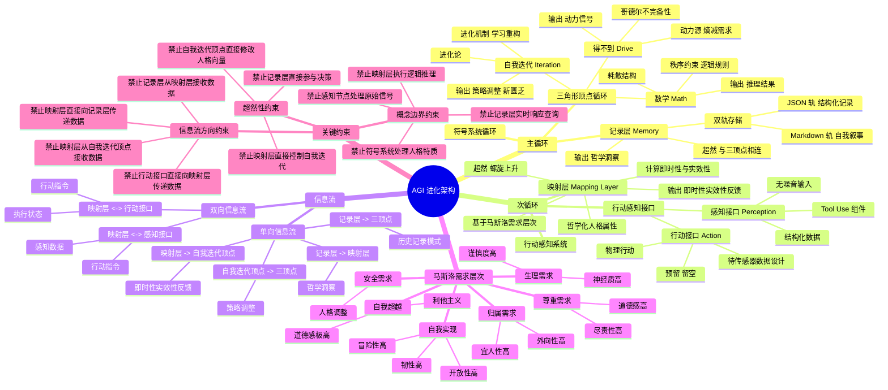

# 架构脑图



---

## 架构脑图说明

### 脑图结构

架构脑图使用 Mermaid 语法，分为四个主要分支：

1. **主循环**（符号系统循环）
   - 三角形顶点循环（得不到、数学、自我迭代）
   - 记录层（超然，双轨存储）

2. **次循环**（行动感知系统）
   - 映射层（超然，螺旋上升）
   - 行动感知接口（感知 + 行动）

3. **信息流**
   - 单向信息流（4 条）
   - 双向信息流（2 条）

4. **马斯洛需求层次**
   - 5 个需求层次
   - 每个层次对应的人格调整

5. **关键约束**
   - 信息流方向约束（4 条）
   - 概念边界约束（4 条）
   - 超然性约束（3 条）

### 使用方法

#### 在支持 Mermaid 的工具中查看

1. **在线工具**：
   - 打开 https://mermaid.live/
   - 将上面的 Mermaid 代码粘贴到编辑器
   - 查看脑图可视化

2. **Markdown 编辑器**：
   - 使用支持 Mermaid 的 Markdown 编辑器（如 Typora、Obsidian）
   - 将上面的 Mermaid 代码粘贴到文档中
   - 查看脑图渲染结果

3. **命令行工具**：
   ```bash
   # 安装 Mermaid CLI
   npm install -g @mermaid-js/mermaid-cli

   # 将脑图导出为 SVG/PNG
   mmdc -i ARCHITECTURE_MINDMAP.md -o architecture_mindmap.svg
   ```

### 脑图的优势

1. **可视化架构**：
   - 直观展示主循环与次循环的关系
   - 清晰呈现信息流方向
   - 完整展示马斯洛需求层次的映射

2. **快速理解**：
   - 新人可以通过脑图快速理解架构
   - 维护者可以通过脑图快速定位组件
   - 审查者可以通过脑图快速验证约束

3. **易于维护**：
   - 修改架构时同步更新脑图
   - 保持脑图与架构文档的一致性
   - 使用文本格式，版本控制友好

---

## 信息流验证机制

### 验证流程

在实现任何信息流操作时，必须按以下流程验证：

```
步骤 1：识别信息流
  - 起点：[组件名称]
  - 终点：[组件名称]
  - 数据类型：[数据类型]

步骤 2：查询脑图
  - 在脑图中找到起点和终点
  - 确认信息流是否存在
  - 确认信息流方向是否正确

步骤 3：查询约束清单
  - 查询 ARCHITECTURE.md 中的"信息流约束"部分
  - 确认此信息流没有违反任何约束

步骤 4：实现代码
  - 如果所有检查通过，实现代码
  - 如果有任何检查失败，拒绝实现

步骤 5：添加标注
  - 在代码中添加强制标注
  - 记录发送者、接收者、数据类型、信息流方向
```

### 验证示例

**场景：记录层向映射层传递哲学洞察**

```
验证过程：

步骤 1：识别信息流
  - 起点：记录层
  - 终点：映射层
  - 数据类型：哲学洞察

步骤 2：查询脑图
  - 在脑图中找到"记录层" → "映射层"
  - 确认信息流存在于"单向信息流"分支
  - 确认方向是"记录层 -> 映射层" ✅

步骤 3：查询约束清单
  - 查询 ARCHITECTURE.md 中的"信息流约束"部分
  - 确认：记录层 → 映射层 | 哲学洞察 | 只传递哲学洞见，禁止反向通信 ✅

步骤 4：实现代码
  - 所有检查通过，允许实现 ✅

步骤 5：添加标注
  - 在代码中添加强制标注：
    # 发送者：记录层
    # 接收者：映射层
    # 数据类型：哲学洞察
    # 信息流方向：单向
    # 显式约束：ARCHITECTURE.md 单向信息流第 1 条
```

---

## 组件权责边界验证

### 验证清单

在实现任何组件功能时，必须按以下清单验证：

```
□ 1. 查询脑图中的组件定义
    □ 确认组件的核心职责
    □ 确认组件的输入
    □ 确认组件的输出

□ 2. 查询 ARCHITECTURE.md 中的"组件权责边界"
    □ 确认此功能在组件职责范围内
    □ 确认输入数据类型正确
    □ 确认输出数据类型正确

□ 3. 查询脑图中的"关键约束"
    □ 确认没有违反信息流方向约束
    □ 确认没有违反概念边界约束
    □ 确认没有违反超然性约束

□ 4. 实现代码
    □ 如果所有检查通过，实现代码
    □ 如果有任何检查失败，拒绝实现

□ 5. 添加标注
    □ 在代码中添加强制标注
    □ 记录组件职责、输入输出、约束
```

### 验证示例

**场景：映射层计算即时性**

```
验证过程：

□ 1. 查询脑图中的组件定义
    □ 组件：映射层
    □ 核心职责：计算即时性与实效性 ✅
    □ 输入：感知数据、行动执行结果 ✅
    □ 输出：即时性、实效性反馈 ✅

□ 2. 查询 ARCHITECTURE.md 中的"组件权责边界"
    □ 组件：映射层
    □ 核心职责：计算即时性与实效性 ✅
    □ 输入：感知数据、行动执行结果 ✅
    □ 输出：即时性、实效性反馈 ✅
    □ 确认此功能在组件职责范围内 ✅

□ 3. 查询脑图中的"关键约束"
    □ 信息流方向约束：
      → 映射层 -> 自我迭代顶点 | 即时性实效性反馈 | 单向反馈 ✅
    □ 概念边界约束：
      → 禁止映射层执行逻辑推理 ✅
      → 此功能是"计算实效性"，不是"逻辑推理" ✅
    □ 超然性约束：
      → 禁止映射层直接控制自我迭代 ✅
      → 此功能是"提供反馈"，不是"直接控制" ✅

□ 4. 实现代码
    □ 所有检查通过，允许实现 ✅

□ 5. 添加标注
    □ 在代码中添加强制标注：
    # 组件：映射层
    # 职责：计算即时性与实效性
    # 输入：感知数据、行动执行结果
    # 输出：即时性、实效性反馈
    # 约束：映射层 -> 自我迭代顶点（单向反馈）
```

---

## 系统性验证机制

### 验证工具

#### 工具 1：脑图可视化验证

**用途**：
- 快速验证架构拓扑
- 可视化信息流方向
- 定位组件位置

**使用方法**：
1. 在 Mermaid Live 中打开脑图
2. 查找起点和终点
3. 确认信息流方向

**示例**：
```
问题：记录层是否可以向映射层请求数据？

验证：
1. 在脑图中找到"记录层"和"映射层"
2. 查找"记录层 -> 映射层"的信息流
3. 确认方向是"单向"的
4. 确认没有"映射层 -> 记录层"的信息流

结论：记录层不可以向映射层请求数据
```

---

#### 工具 2：约束清单验证

**用途**：
- 验证信息流方向
- 验证概念边界
- 验证超然性

**使用方法**：
1. 查询 ARCHITECTURE.md 中的"关键约束"部分
2. 确认信息流是否违反约束
3. 如果违反，拒绝实现

**示例**：
```
问题：映射层是否可以执行逻辑推理？

验证：
1. 查询 ARCHITECTURE.md 中的"概念边界约束"部分
2. 找到：禁止映射层执行逻辑推理（交给符号系统）
3. 确认此功能违反了约束

结论：映射层不可以执行逻辑推理
```

---

#### 工具 3：权责边界验证

**用途**：
- 验证组件职责
- 验证输入输出
- 验证信息流方向

**使用方法**：
1. 查询 ARCHITECTURE.md 中的"组件权责边界"表格
2. 确认此功能在组件职责范围内
3. 确认输入输出数据类型正确

**示例**：
```
问题：记录层是否可以实时响应查询？

验证：
1. 查询 ARCHITECTURE.md 中的"组件权责边界"表格
2. 找到记录层：
   - 核心职责：存储记录、提取洞见
   - 输入：交互数据
   - 输出：哲学洞察
3. 确认"实时响应查询"不在记录层职责范围内
4. 查询"概念边界约束"：禁止记录层实时响应查询（只单向传递哲学洞察）

结论：记录层不可以实时响应查询
```

---

### 违约检测

#### 违约类型

| 违约类型 | 描述 | 严重性 | 处理方式 |
|---------|------|--------|---------|
| **信息流方向错误** | 单向信息流被实现为双向 | 严重 | 立即报错，拒绝实现 |
| **概念边界违反** | 组件执行了超出职责范围的操作 | 严重 | 立即报错，拒绝实现 |
| **超然性违反** | 超然组件直接参与决策或控制 | 严重 | 立即报错，拒绝实现 |

#### 违约处理流程

```
检测到违约 → 立即报错 → 记录到违约日志 → 拒绝实现 → 重新设计
```

---

## 最后的话

> **架构脑图是架构的地图，约束清单是架构的边界。**
>
> **在实现任何功能之前，都要先查脑图，再查清单。**

**验证三部曲**：
1. 查脑图：确认信息流方向
2. 查清单：确认没有违反约束
3. 实现代码：添加强制标注

**如果验证失败，不要实现。**
